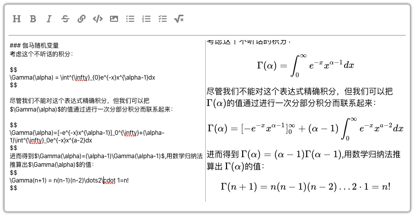

# The editor for markdown That support Latex by katex

#### This is a react Component，That is a editor support Latex and markdown

Screenshot：




usage:
```sh
git clone https://github.com/Triment/react-markdown-editor yourdir

cd yourdir
yarn
yarn start
```


Completed:
- [x] UI
- [x] render
- [x] selection

TodoList：
- [ ] fix bug
- [ ] optimize compiler
- [ ] code highlight
- [ ] Configurable

feedback: 13198898368@163.com


